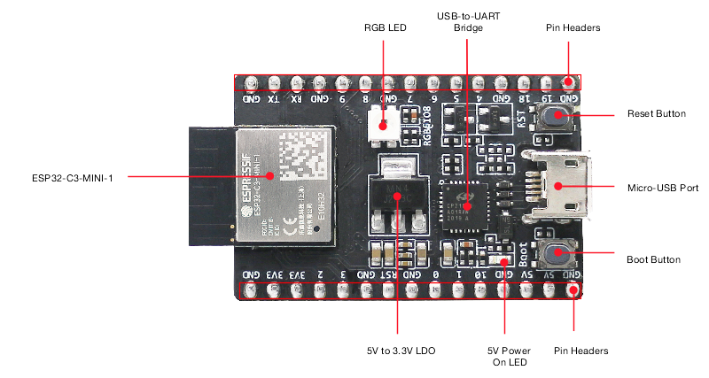
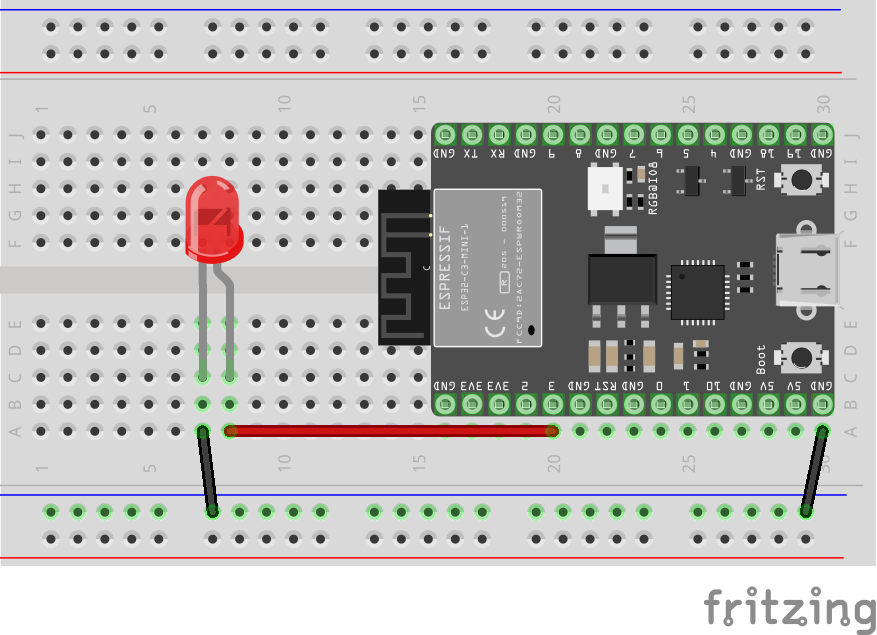
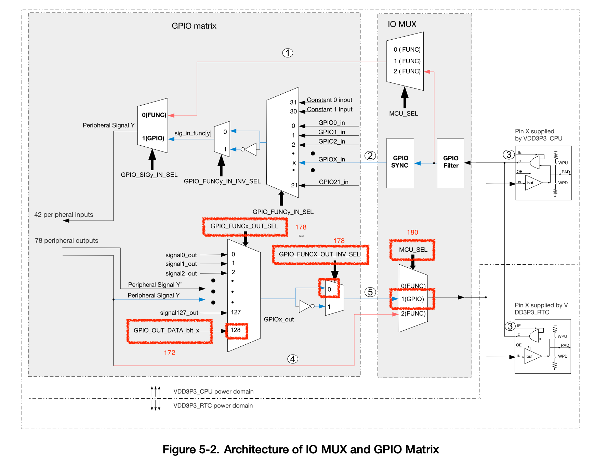

# Blink an LED with RISC-V assembly
This example shows how to toggle a GPIO pin with RISC-V assembly only using registers as described in the [ESP32­C3
Technical Reference Manual](https://www.espressif.com/sites/default/files/documentation/esp32-c3_technical_reference_manual_en.pdf).

# Setup the ESP32-C3-DevKitM-1
## The RISC-V Instruction Set Architecture
RISC-V is an open standard instruction set architecture (ISA) based on established reduced instruction set computer principles. Unlike most other ISA designs, RISC-V is provided under royalty-free open-source licenses.
- [RISC-V Specifications](https://riscv.org/technical/specifications/) with ISA Specifications
- [RISC-V Assembler Reference](https://michaeljclark.github.io/asm.html)

## The RISC-V based ESP32 C3 DevKit-M1

The RISC-V based ESP32 C3 DevKit-M1 is a cost-effective and well documented device with a RISC-V MCU. See here for details:
- [Espressif ESP32-C3](https://www.espressif.com/en/products/socs/esp32-c3)
- [User Guide](https://docs.espressif.com/projects/esp-idf/en/latest/esp32c3/hw-reference/esp32c3/user-guide-devkitm-1.html)
- [ESP32­C3 Technical Reference Manual](https://www.espressif.com/sites/default/files/documentation/esp32-c3_technical_reference_manual_en.pdf)

## Hardware setup
The following Fritzung diagram shows the wiring. Please note that I used a LED with in-build resistor. You have to use a resistor for a common LED.


## The ESP-IDF
ESP-IDF is Espressif's official IoT Development Framework for the ESP32, ESP32-S, ESP32-C and ESP32-H series of SoCs. See [here](https://www.espressif.com/en/products/sdks/esp-idf#:~:text=ESP%2DIDF%20is%20Espressif's%20official,ESP32%2DH%20series%20of%20SoCs.) for details. I use the [VS Code extension](https://github.com/espressif/vscode-esp-idf-extension) 
for creating, building and flashing projects.

# GPIO matrix and IO MUX
The following diagram from the 
[ESP32­C3 Technical Reference Manual](https://www.espressif.com/sites/default/files/documentation/esp32-c3_technical_reference_manual_en.pdf)
(p 153) shows the datapath and the registers involved in GPIO output with added page references.


## Enable GPIO3 output
GPIO output has to be enabled by setting the respective bit in register `GPIO_ENABLE_REG (0x0024)`. See 5.1.1 (p 161) and p 73 in
[ESP32­C3 Technical Reference Manual](https://www.espressif.com/sites/default/files/documentation/esp32-c3_technical_reference_manual_en.pdf)
for details.

The following code snippet shows how the GPIO3 output is enabled:
```
lw t0,gpiobase   # load base address for GPIO registers into t0
lb t1,enable     # load offset for GPIO_ENABLE_REG into t1
or t2,t0,t1      # add offset to address and store address in t2
li t0,1          # load 1 in register t0
slli t0,t0,3     # shift 1 left by 3 positions
sw t0,0(t2)      # store value to GPIO_ENABLE_REG
```

## Set GPIO matrix GPIO_FUNC_OUT_SEL with a special peripheral index 128 (0×80)
Simple GPIO output (see section 5.5.3, p 158 in 
[ESP32­C3 Technical Reference Manual](https://www.espressif.com/sites/default/files/documentation/esp32-c3_technical_reference_manual_en.pdf))
the special value `0x80` has to be loaded in the register `GPIO_FUNCn_OUT_SEL_CFG_REG`. 
The address is `0x0554+4*n` and therefore `0x0560` for `GPIO3` (see p 170, 178) for details. 

The following code snippet shows how to load the special index into the GPIO_FUNC_OUT_SEL register:
```
lw t0,gpiobase  # load base address for GPIO registers into t0
lh t1,funcsel   # load offset for GPIO_FUNC3_OUT_SEL
or t2,t0,t1     # add offset for GPIO_FUNC3_OUT_SEL and store address in t2
lbu t0,index    # load index (0x80) into t0
sw t0,0(t2)     # store index to GPIO_FUNC3_OUT_SEL
```

## Set the corresponding bit in GPIO_OUT_REG register 
To set the appropriate bit for the output for `GPIO3` is has to be set in `GPIO_OUT_REG (0x0004)`.
Recommended operation is to use `GPIO_OUT_W1TS_REG (0x0008)` to set the bit in `GPIO_OUT_REG`. See p 172 in 
[ESP32­C3 Technical Reference Manual](https://www.espressif.com/sites/default/files/documentation/esp32-c3_technical_reference_manual_en.pdf)
for details.

The following code snippet shows how to set the corresponding bit in GPIO_OUT_REG register:
```
lw t0,gpiobase  # load base address for GPIO registers into t0
lb t1,set       # load offset for GPIO_OUT_W1TS_REG
or t2,t0,t1     # add offset for GPIO_OUT_W1TS_REG
li t0,1         # load 1 in register t0
slli t0,t0,3    # shift 1 left by 3 positions
sw t0,0(t2)     # store value to GPIO_OUT_W1TS_REG
```

## Clear the corresponding bit in GPIO_OUT_REG register
To clear the appropriate bit for the output for `GPIO3` is has to be cleared in `GPIO_OUT_REG (0x0004)`.
Recommended operation is to use `GPIO_OUT_W1TC_REG (0x000C)` to clear the bit in `GPIO_OUT_REG`. See p 173 in 
[ESP32­C3 Technical Reference Manual](https://www.espressif.com/sites/default/files/documentation/esp32-c3_technical_reference_manual_en.pdf)
for details.

The following code snippet shows how to clear the corresponding bit in GPIO_OUT_REG register:
```
lw t0,gpiobase  # load base address for GPIO registers into t0
lb t1,clear     # load offset for GGPIO_OUT_W1TC_REG
or t2,t0,t1     # add offset for GPIO_OUT_W1TC_REG 
li t0,1         # load 1 in register t0
slli t0,t0,3    # shift 1 left by 3 positions
sw t0,0(t2)     # store value to GPIO_OUT_W1TC_REG
```
